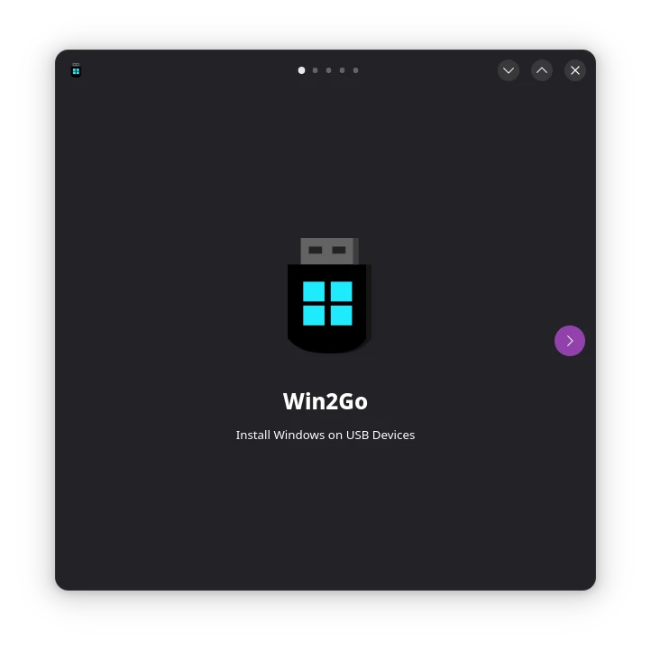
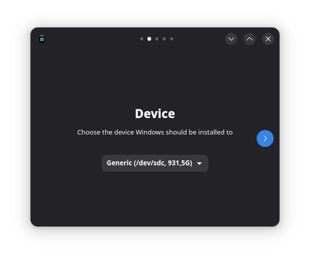
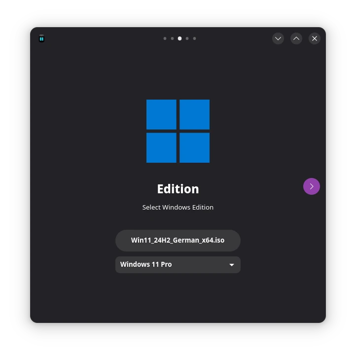
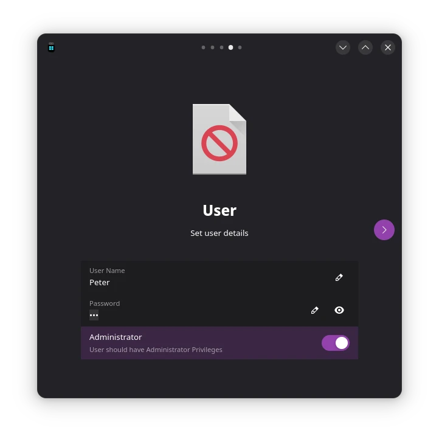
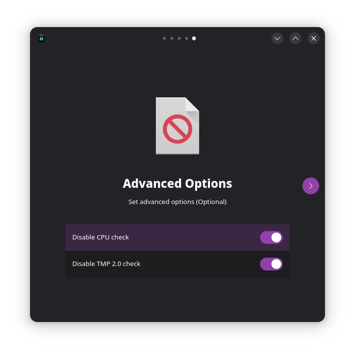

# Win2GO

Flatpak application to create portable Windows installations on USB drives.

## Development requirements
- gettext-tools (optional extracting pot-file)
- wimtools
- gcc
- python3-devel
- cmake
- gobject-introspection-devel
- typelib-1_0-Adw-1

## Test requirements
- Gnome Builder (Test build of flatpak)

## Special Thanks to
- [jxctn0](https://github.com/jxctn0/win2go) without this script I didn't knew how to pull this off

## Screenshots

