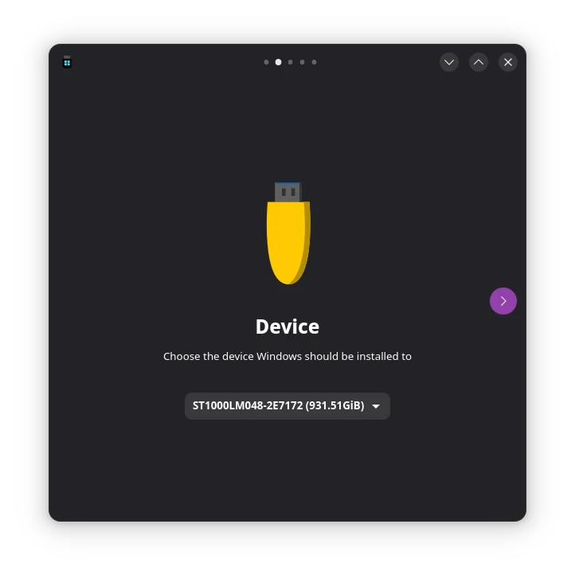

# Win2GO

Flatpak application to create portable Windows installations on USB devices.

This tool is not used to create bootable Windows install media but rather to create a fully functional, portable, persistent installation of the entire operating system to a USB device.

Linux users call this "Live Version" but persistent instead of in-memory.

Portable SSD highly recommended.

## Features
- List and select removable media (0B devices are hidden)
- Open and Mount Windows ISO images
- List and select available Windows Editions contained on ISO image

### Work in Progress
- Set user details
- Registry edits
- Format removable media as gpt
- Create BOOT and WINDOWS partition
- Extract selected Windows edition to device
- Setup Windows Bootloader
- Unmount and remove loop device of ISO image

## Development requirements
- gettext-tools (optional extracting pot-file)
- wimtools
- gcc
- python3-devel
- cmake
- gobject-introspection-devel
- typelib-1_0-Adw-1
- cairo-devel
- dbus-1-devel

`sudo zypper in gettext-tools wimtools gcc python3-devel cmake gobject-introspection-devel typelib-1_0-Adw-1 cairo-devel dbus-1-devel`

### Python Packages
- dasbus

## Test requirements
- Gnome Builder (Test build of flatpak)
- Workbench to test and create blueprints

## Special Thanks to
- [jxctn0](https://github.com/jxctn0/win2go) without this script I didn't knew how to pull this off
- [dasbus](https://github.com/dasbus-project/dasbus) For this nice (UnixFD enabled) dbus abstraction for python
- [BCS-SYS](https://github.com/jpz4085/BCD-SYS) For Linux native Windows Bootloader tool

## Screenshots

